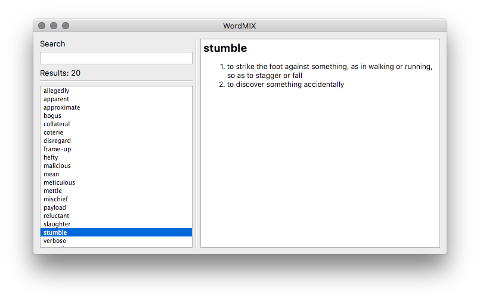

# WordMIX
[](https://travis-ci.com/gchlebus/WordMIX)


Learn new words by making your own dictionary.


# Installation

```
# Tested with Qt 5.11.1
brew install qt
export PATH="/usr/local/opt/qt/bin:$PATH"

git clone https://github.com/gchlebus/WordMIX.git
cd WordMIX/WordMIX
qmake && make && make install
```

