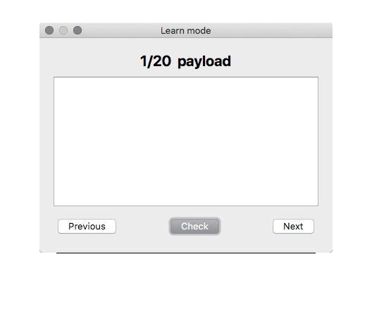

# WordMIX - Train foreign language vocabulary by creating your own dictionary
[](https://travis-ci.com/gchlebus/WordMIX)
[](https://opensource.org/licenses/BSD-3-Clause)

<p align="center">
  
</p>

## How it works

- Add words and their definitions to the dictionary.
- Memorize them using the **Learn mode**.

## Main window


## Learn mode

<p align="center">
  
</p>

# Installation

## macOS

```
# Tested with Qt 5.11.1
brew install qt
export PATH="/usr/local/opt/qt/bin:$PATH"

git clone https://github.com/gchlebus/WordMIX.git
cd WordMIX/WordMIX
qmake && make && make install
```

